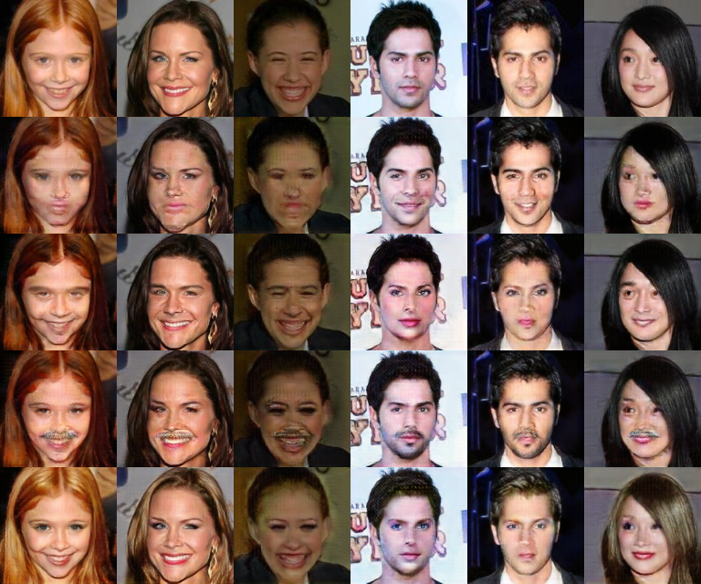
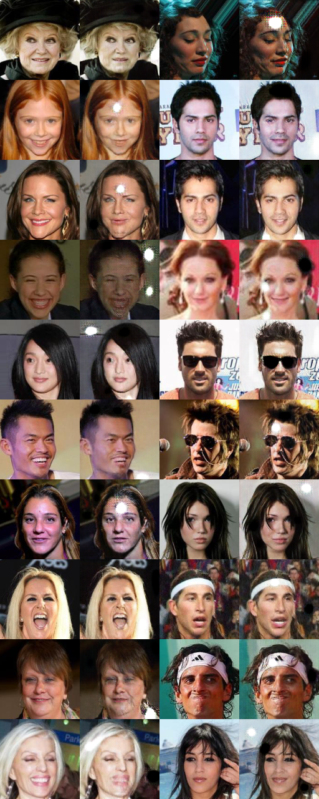

# Smile
This repository contains Tensorflow implementations of some models dealing with image translation. Here they are 
applied to the problem of facial attribute editing (e.g. smile to non-smile and vice versa). Some models can only
handle one attribute at a time and some can handle multiple.

## Download and Prepare Dataset
For dataset split on a given feature. (Expected by CycleGAN, etc).
```bash
$ python -m smile.data.prepare.create_dataset --dataset-dir datasets/celeb --split-attribute Smiling
```

For dataset with attributes included in Tfrecords. (Expected by AttGAN, etc).
```bash
$ python -m smile.data.prepare.create_dataset --dataset-dir datasets/celeb --include-attributes
```

## Results

### CycleGAN
```bash
$ python -m smile.models.cyclegan.train \
    --x-train datasets/celeb/tfrecords/smiling/train/* \
    --x-test datasets/celeb/tfrecords/smiling/test/* \
    --y-train datasets/celeb/tfrecords/not_smiling/train/* \
    --y-test datasets/celeb/tfrecords/not_smiling/test/*
```


[See more results and commands to recreate](results/cyclegan/results.md)

### AttGAN
```bash
$ python -m smile.models.attgan.train \
    --train-tfrecords datasets/celeb/tfrecords/all_attributes/train/* \
    --test-tfrecords datasets/celeb/tfrecords/all_attributes/test/* \
    --considered-attributes Smiling Male Mustache Blond_Hair
```


[See more results and commands to recreate](results/attgan/results.md)

### StarGAN
```bash
$ python -m smile.models.stargan.train \
    --train-tfrecords datasets/celeb/tfrecords/all_attributes/train/* \
    --test-tfrecords datasets/celeb/tfrecords/all_attributes/test/* \
    --considered-attributes Smiling Male Mustache Blond_Hair
```



[See more results and commands to recreate](results/stargan/results.md)

### UNIT
```bash
$ python -m smile.models.unit.train \
    --x-train datasets/celeb/tfrecords/smiling/train/* \
    --x-test datasets/celeb/tfrecords/smiling/test/* \
    --y-train datasets/celeb/tfrecords/not_smiling/train/* \
    --y-test datasets/celeb/tfrecords/not_smiling/test/* \
    --adversarial_loss lsgan
```



[See more results and commands to recreate](results/unit/results.md)

### Celeb-A attribute ratios
| | On | Off |
|---|---:|---:|
| 5_o_Clock_Shadow | 0.111 | 0.889 |
| Arched_Eyebrows | 0.267 | 0.733 |
| Attractive | 0.513 | 0.487 |
| Bags_Under_Eyes | 0.205 | 0.795 |
| Bald | 0.022 | 0.978 |
| Bangs | 0.152 | 0.848 |
| Big_Lips | 0.241 | 0.759 |
| Big_Nose | 0.235 | 0.765 |
| Black_Hair | 0.239 | 0.761 |
| Blond_Hair | 0.148 | 0.852 |
| Blurry | 0.051 | 0.949 |
| Brown_Hair | 0.205 | 0.795 |
| Bushy_Eyebrows | 0.142 | 0.858 |
| Chubby | 0.058 | 0.942 |
| Double_Chin | 0.047 | 0.953 |
| Eyeglasses | 0.065 | 0.935 |
| Goatee | 0.063 | 0.937 |
| Gray_Hair | 0.042 | 0.958 |
| Heavy_Makeup | 0.387 | 0.613 |
| High_Cheekbones | 0.455 | 0.545 |
| Male | 0.417 | 0.583 |
| Mouth_Slightly_Open | 0.483 | 0.517 |
| Mustache | 0.042 | 0.958 |
| Narrow_Eyes | 0.115 | 0.885 |
| No_Beard | 0.835 | 0.165 |
| Oval_Face | 0.284 | 0.716 |
| Pale_Skin | 0.043 | 0.957 |
| Pointy_Nose | 0.277 | 0.723 |
| Receding_Hairline | 0.08 | 0.92 |
| Rosy_Cheeks | 0.066 | 0.934 |
| Sideburns | 0.057 | 0.943 |
| Smiling | 0.482 | 0.518 |
| Straight_Hair | 0.208 | 0.792 |
| Wavy_Hair | 0.32 | 0.68 |
| Wearing_Earrings | 0.189 | 0.811 |
| Wearing_Hat | 0.048 | 0.952 |
| Wearing_Lipstick | 0.472 | 0.528 |
| Wearing_Necklace | 0.123 | 0.877 |
| Wearing_Necktie | 0.073 | 0.927 |
| Young | 0.774 | 0.226 |

### Celeb-A attribute correlations


## TODO
* Add gif of progress samples.
* Add evaluation method based on classifier of identities? sort of like inception score

### Models / Papers
- [x] CycleGAN
- [x] AttGAN
- [x] UNIT (bad results, needs work)
- [x] StarGAN
- [ ] Augmented CycleGAN
- [ ] Sparsely Grouped GAN
- [ ] Fusion GAN
- [ ] DiscoGAN
- [ ] MUNIT
- [ ] XGAN
- [ ] DTN

### General
* Spectral normalization
* Progressive growing utility
* Attention mechanism, see self-attention GAN
* Facial landmarks as supervision
* https://github.com/yingcong/Facelet_Bank
* Simultaneous vs alternating gradient descent.
* TTUR
* Standardize architecture for comparisons. Densenet, resnet, unet.
* Try other upsampling methods, see some checkerboarding sometimes. Or tune kernel sizes / strides.

### Engineering
* Docker for reproducing. 
* Add terraform/cloudformation scripts for cloud resource management.
