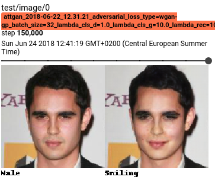

# Smile
This repository contains Tensorflow implementations of some models dealing with image translation. Here they are 
applied to the problem of facial attribute editing (e.g. smile to non-smile and vice versa). Some models can only
handle one attribute at a time and some can handle multiple.

## Download and Prepare Dataset
For dataset split on a given feature. (Expected by CycleGAN, etc).
```bash
$ python -m smile.utils.data.create_dataset --dataset-dir datasets/celeb --split-attribute Smiling
```

For dataset with attributes included in Tfrecords. (Expected by AttGAN, etc).
```bash
$ python -m smile.utils.data.create_dataset --dataset-dir datasets/celeb --include-attributes
```

## Results

### CycleGAN
```bash
$ python -m smile.cyclegan.train \
    --X-train datasets/celeb/tfrecords/smiling/train/* \
    --X-test datasets/celeb/tfrecords/smiling/test/* \
    --Y-train datasets/celeb/tfrecords/not_smiling/train/* \
    --Y-test datasets/celeb/tfrecords/not_smiling/test/*
```

For more options:
```bash
$ python -m smile.cyclegan.train --help
```


Some cherrypicks.


### AttGAN
TODO: Add command to recreate.



## TODO
* Better results images per model.

### CycleGAN
Revisit some of these
* WGAN-GP loss
* Densenet architecture(s)
* Spectral normalization
* Progressive growing
* Attention mechanism, see self-attention GAN
* Facial landmarks as supervision

### Other models
* DiscoGAN
* StarGAN (working code, bad results)
* UNIT (working code, bad results)
* MUNIT
* DTN
* XGAN
* DA-gan model
* AttGAN
* https://github.com/yingcong/Facelet_Bank
