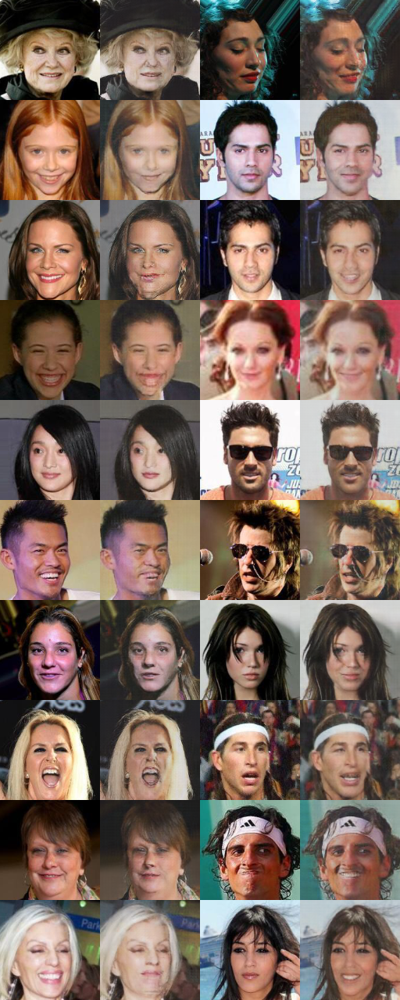
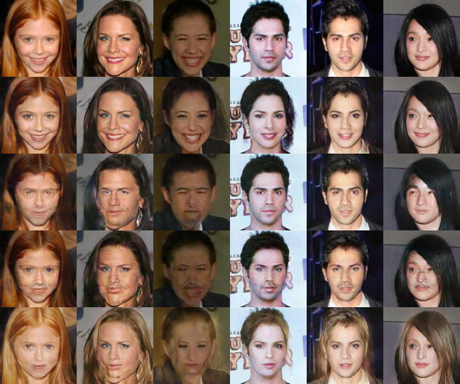

# Smile
This repository contains Tensorflow implementations of some models dealing with image translation. Here they are 
applied to the problem of facial attribute editing (e.g. smile to non-smile and vice versa). Some models can only
handle one attribute at a time and some can handle multiple.

## Download and Prepare Dataset
For dataset split on a given feature. (Expected by CycleGAN, etc).
```bash
$ python -m smile.data.prepare.create_dataset --dataset-dir datasets/celeb --split-attribute Smiling
```

For dataset with attributes included in Tfrecords. (Expected by AttGAN, etc).
```bash
$ python -m smile.data.prepare.create_dataset --dataset-dir datasets/celeb --include-attributes
```

## Results

### CycleGAN
```bash
$ python -m smile.models.cyclegan.train \
    --x-train datasets/celeb/tfrecords/smiling/train/* \
    --x-test datasets/celeb/tfrecords/smiling/test/* \
    --y-train datasets/celeb/tfrecords/not_smiling/train/* \
    --y-test datasets/celeb/tfrecords/not_smiling/test/*
```



[See more results and commands to recreate](results/cyclegan/results.md)

### AttGAN
```bash
$ python -m smile.models.attgan.train \
    --train-tfrecords datasets/celeb/tfrecords/all_attributes/train/* \
    --test-tfrecords datasets/celeb/tfrecords/all_attributes/test/* \
    --considered-attributes Smiling Male Mustache Blond_Hair
```



[See more results and commands to recreate](results/attgan/results.md)

### StarGAN
TODO: Show results.

### UNIT
TODO: Show results.

## TODO
* Better results images per model. Show results at different timesteps.
* Add evaluation method based on classifier of identities? sort of like inception score

### Models / Papers
- [x] CycleGAN
- [x] AttGAN
- [x] UNIT (bad results, needs work)
- [x] StarGAN (bad results, needs work)
- [ ] Augmented CycleGAN
- [ ] Sparsely Grouped GAN
- [ ] Fusion GAN
- [ ] DiscoGAN
- [ ] MUNIT
- [ ] XGAN
- [ ] DTN

### General
* Spectral normalization
* Progressive growing utility
* Attention mechanism, see self-attention GAN
* Facial landmarks as supervision
* https://github.com/yingcong/Facelet_Bank
* Simultaneous vs alternating gradient descent.
* TTUR
* Standardize architecture for comparisons. Densenet, resnet, unet.
* Try other upsampling methods, see some checkerboarding sometimes. Or tune kernel sizes / strides.

### Engineering
* Docker for reproducing. 
* Add terraform/cloudformation scripts for cloud resource management.
