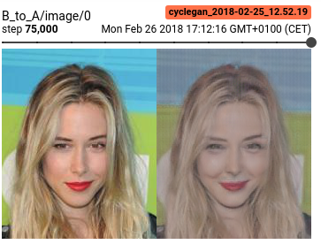
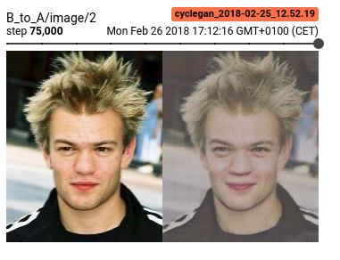

# Smile

## Prerequisites
* Download [celeb dataset](http://mmlab.ie.cuhk.edu.hk/projects/CelebA.html).

## Prepare tfrecords
```bash
$ python scripts/prepare_celeb.py --attributes-csv path/to/list_attr_celeba.txt --img-dir path/to/img_align_celeba --output-dir path/to/output --attribute Smiling
```

## Run training
```bash
$ python -m smile.train -X path/to/smilerecords/* -Y path/to/not_smilerecords/* --batch-size 32
```

## Results
Some cherrypicks.





## TODO

### CycleGAN
* WGAN-GP loss
* Densenet architecture(s)
* "Muted" color issue, solved?
* DTN model
* DA-gan model
