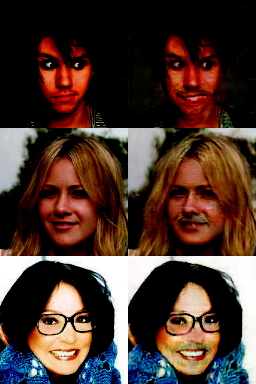

# AttGAN Results
These are results for some AttGAN experiments.

* TODO: Specify the attributes used.
* TODO: Rerun these without augmentation/fix augmentation?

To see all attgan options:
```bash
$ python -m smile.models.attgan.train --help
```

---

```bash
$ python -m smile.models.attgan.train \
    --train_tfrecords datasets/celeb/tfrecords/all_attributes/train/* \
    --test_tfrecords datasets/celeb/tfrecords/all_attributes/test/*
```



---

```bash
$ python -m smile.models.attgan.train \
    --train_tfrecords datasets/celeb/tfrecords/all_attributes/train/* \
    --test_tfrecords datasets/celeb/tfrecords/all_attributes/test/* \
    --model_architecture resnet
```

```bash
$ python -m smile.models.attgan.train \
    --train_tfrecords datasets/celeb/tfrecords/all_attributes/train/* \
    --test_tfrecords datasets/celeb/tfrecords/all_attributes/test/* \
    --model_architecture resnet
```

