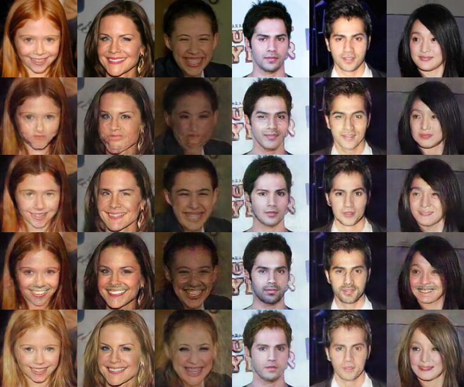

# AttGAN Results
These are results for some AttGAN experiments.

To see all attgan options:
```bash
$ python -m smile.models.attgan.train --help
```

---

```bash
$ python -m smile.models.attgan.train \
    --train-tfrecords datasets/celeb/tfrecords/all_attributes/train/* \
    --test-tfrecords datasets/celeb/tfrecords/all_attributes/test/* \
    --considered-attributes Smiling Male Mustache Blond_Hair
```


---

```bash
$ python -m smile.models.attgan.train \
    --train-tfrecords datasets/celeb/tfrecords/all_attributes/train/* \
    --test-tfrecords datasets/celeb/tfrecords/all_attributes/test/* \
    --considered-attributes Smiling Male Mustache Blond_Hair \
    --lambda_rec 50.0 \
    --lambda_cls_g 25.0
```



