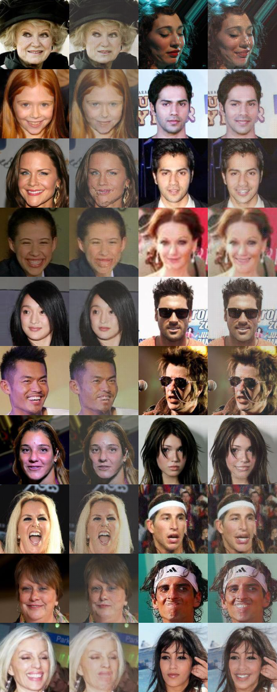
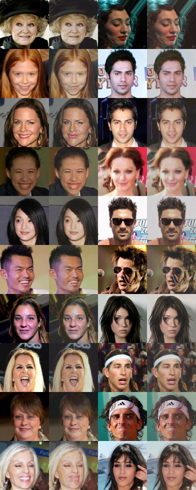
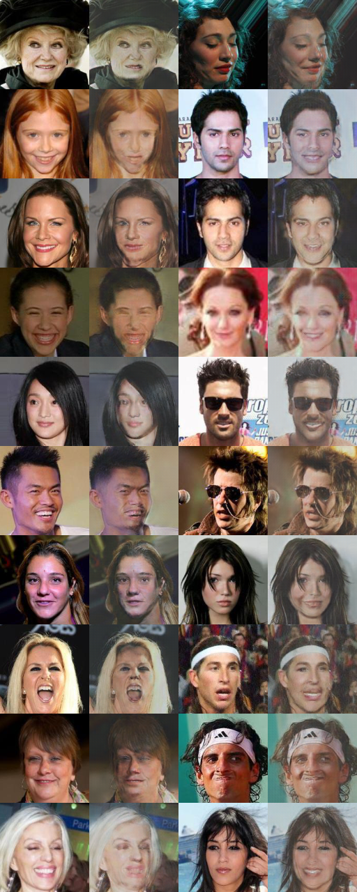

# CycleGAN Results
These are results for some CycleGAN experiments.

To see all cyclegan options:
```bash
$ python -m smile.models.cyclegan.train --help
```

---

```bash
$ python -m smile.models.cyclegan.train \
    --x-train datasets/celeb/tfrecords/smiling/train/* \
    --x-test datasets/celeb/tfrecords/smiling/test/* \
    --y-train datasets/celeb/tfrecords/not_smiling/train/* \
    --y-test datasets/celeb/tfrecords/not_smiling/test/*
```


---

```bash
$ python -m smile.models.cyclegan.train \
    --x-train datasets/celeb/tfrecords/smiling/train/* \
    --x-test datasets/celeb/tfrecords/smiling/test/* \
    --y-train datasets/celeb/tfrecords/not_smiling/train/* \
    --y-test datasets/celeb/tfrecords/not_smiling/test/* \
    --lambda_cyclic 10.0
```



---

```bash
$ python -m smile.models.cyclegan.train \
    --x-train datasets/celeb/tfrecords/smiling/train/* \
    --x-test datasets/celeb/tfrecords/smiling/test/* \
    --y-train datasets/celeb/tfrecords/not_smiling/train/* \
    --y-test datasets/celeb/tfrecords/not_smiling/test/* \
    --lambda_cyclic 20.0
```



---

```bash
$ python -m smile.models.cyclegan.train \
    --x-train datasets/celeb/tfrecords/smiling/train/* \
    --x-test datasets/celeb/tfrecords/smiling/test/* \
    --y-train datasets/celeb/tfrecords/not_smiling/train/* \
    --y-test datasets/celeb/tfrecords/not_smiling/test/* \
    --adversarial_loss wgan-gp
```

