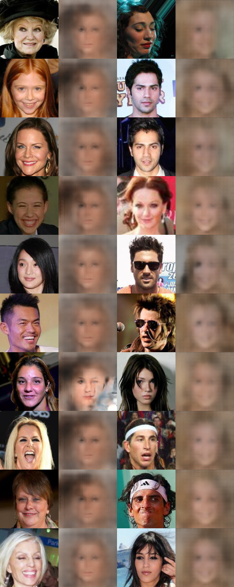

# DiscoGAN Results
These are results for some DiscoGAN experiments.

Note: The official implementation is different in some ways than what is described in the paper
which could explain the mode collapse.

To see all DiscoGAN options:
```bash
$ python -m smile.models.cyclegan.train --help
```

```bash
$ python -m smile.models.cyclegan.train \
    --x-train datasets/celeb/tfrecords/smiling/train/* \
    --x-test datasets/celeb/tfrecords/smiling/test/* \
    --y-train datasets/celeb/tfrecords/not_smiling/train/* \
    --y-test datasets/celeb/tfrecords/not_smiling/test/* \
    --adversarial_loss lsgan
```



